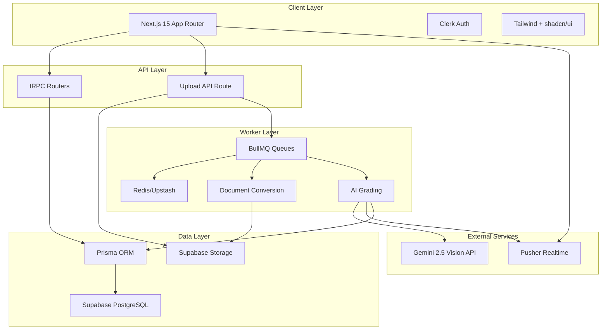
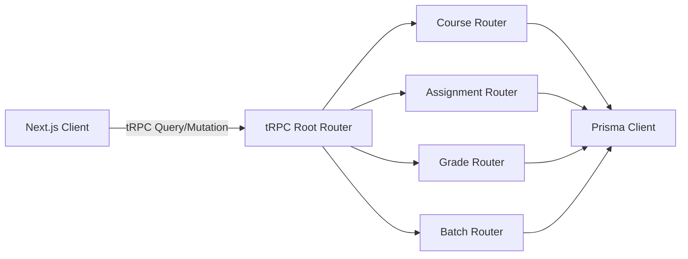
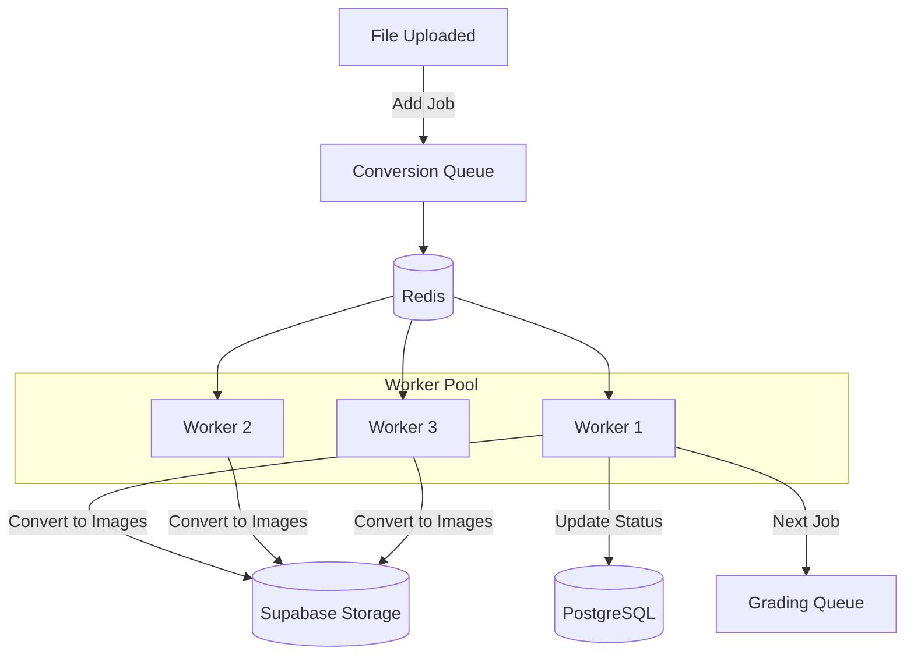
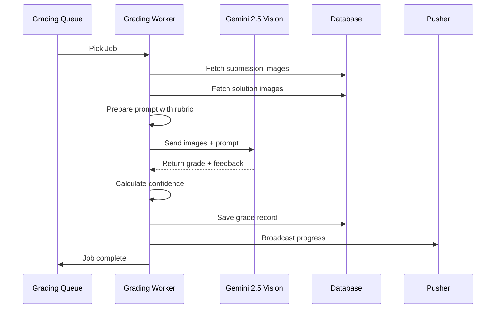
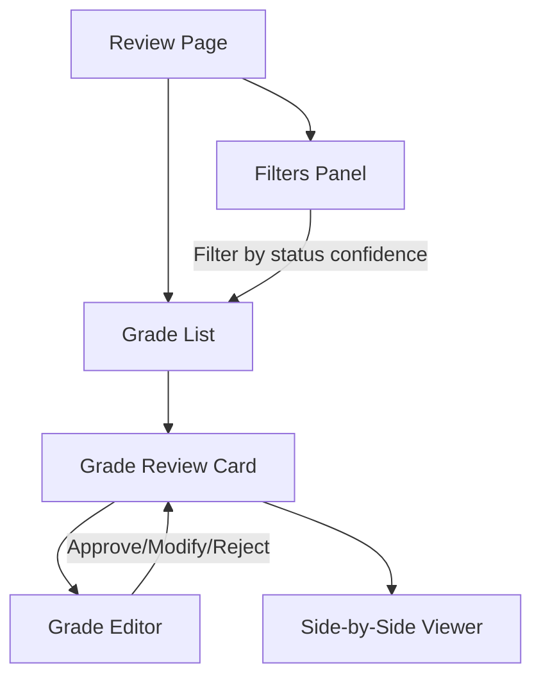
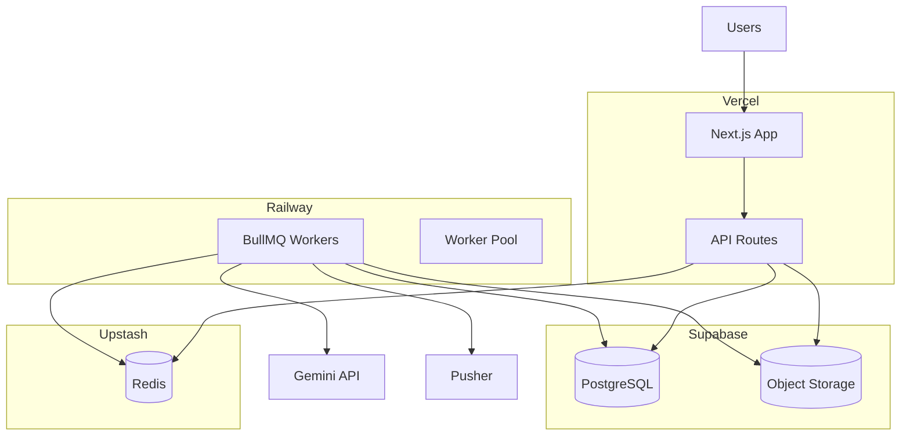

# GradeAssist AI - Full Implementation Plan

## Architecture Overview

## Phase-by-Phase Implementation

### Phase 1: Project Setup & Foundation (2-3 days)

**Goal**: Initialize Next.js project, configure Prisma, set up database schema, and create foundational utilities.

**Key Steps**:

1. Initialize Next.js 15 with TypeScript and Tailwind CSS
2. Install all dependencies from package.json specification
3. Configure environment variables for Supabase, Clerk, Redis, Pusher, Gemini
4. Set up Prisma schema with 14 models (User, Organization, Course, Assignment, Rubric, Solution, Batch, Submission, Grade, etc.)
5. Create utility functions in [`src/lib/utils.ts`](src/lib/utils.ts) for date formatting, file size, student ID extraction
6. Define TypeScript types in [`src/types/index.ts`](src/types/index.ts) with extended Prisma types
7. Create database client in [`src/server/db.ts`](src/server/db.ts)
8. Run initial migration and test database connection

**Critical Files**:

- [`package.json`](package.json) - 40+ dependencies including tRPC, Prisma, BullMQ, Gemini SDK
- [`prisma/schema.prisma`](prisma/schema.prisma) - Complete schema with 14 models, enums, relations
- [`.env.local`](.env.local) - All service credentials (Supabase, Clerk, Redis, Pusher, Gemini keys)
- [`src/lib/constants.ts`](src/lib/constants.ts) - File types, limits, course types, grade statuses

### Phase 2: Authentication & Layout (1-2 days)

**Goal**: Implement Clerk authentication and create dashboard layout with sidebar/header.

**Key Steps**:

1. Configure Clerk provider in [`src/app/layout.tsx`](src/app/layout.tsx)
2. Set up middleware in [`src/middleware.ts`](src/middleware.ts) to protect dashboard routes
3. Create auth pages: [`src/app/(auth)/sign-in/[[...sign-in]]/page.tsx`](src/app/(auth)/sign-in/[[...sign-in]]/page.tsx)
4. Build dashboard layout in [`src/app/(dashboard)/layout.tsx`](src/app/\(dashboard)/layout.tsx)
5. Create Sidebar component with navigation
6. Create Header component with user menu and breadcrumbs
7. Install and configure shadcn/ui components (Button, Dialog, Dropdown, Toast, etc.)
8. Set up Clerk webhook for user sync to database

**Critical Components**:

- [`src/components/layout/Sidebar.tsx`](src/components/layout/Sidebar.tsx) - Navigation with course/assignment links
- [`src/components/layout/Header.tsx`](src/components/layout/Header.tsx) - User profile, notifications
- [`src/app/(dashboard)/page.tsx`](src/app/\(dashboard)/page.tsx) - Dashboard home placeholder

### Phase 3: tRPC Setup & API Routes (3-4 days)

**Goal**: Configure tRPC with Clerk auth context and implement all API routers.

**Key Steps**:

1. Set up tRPC config in [`src/server/api/trpc.ts`](src/server/api/trpc.ts) with Clerk authentication
2. Create root router in [`src/server/api/root.ts`](src/server/api/root.ts)
3. Implement Course router with CRUD operations
4. Implement Assignment router with rubric and solution relations
5. Implement Submission router with file metadata and status updates
6. Implement Grade router with filtering by status and confidence
7. Implement Batch router with progress aggregation
8. Set up tRPC API route handler: [`src/app/api/trpc/[trpc]/route.ts`](src/app/api/trpc/[trpc]/route.ts)
9. Create TRPCProvider component with TanStack Query
10. Add input validation using Zod schemas

**Critical Routers**:

- [`src/server/api/routers/course.ts`](src/server/api/routers/course.ts) - list, create, update, delete, archive
- [`src/server/api/routers/assignment.ts`](src/server/api/routers/assignment.ts) - with solution upload
- [`src/server/api/routers/grade.ts`](src/server/api/routers/grade.ts) - review, approve, modify operations

### Phase 4: File Storage & Upload (2-3 days)

**Goal**: Implement file upload system with Supabase Storage and validate file types.

**Key Steps**:

1. Configure Supabase Storage client in [`src/lib/storage/supabase.ts`](src/lib/storage/supabase.ts)
2. Create storage buckets: `solutions`, `submissions`, `converted-images`
3. Implement upload utilities with signed URLs in [`src/lib/storage/upload.ts`](src/lib/storage/upload.ts)
4. Build DropzoneUploader component using react-dropzone
5. Create FilePreview component for uploaded files
6. Implement upload API route: [`src/app/api/upload/route.ts`](src/app/api/upload/route.ts)
7. Add file validation (type, size, max files per batch)
8. Create BatchUploadProgress component with progress bars
9. Build SubmissionList component to display uploaded files
10. Integrate with tRPC submission router for metadata storage

**Critical Components**:

- [`src/components/upload/DropzoneUploader.tsx`](src/components/upload/DropzoneUploader.tsx) - Drag-drop with validation
- [`src/components/upload/BatchUploadProgress.tsx`](src/components/upload/BatchUploadProgress.tsx) - Real-time progress
- [`src/app/(dashboard)/courses/[courseId]/assignments/[assignmentId]/upload/page.tsx`](src/app/(dashboard)/courses/[courseId]/assignments/[assignmentId]/upload/page.tsx)

### Phase 5: Document Processing Workers (3-4 days)

**Goal**: Create separate worker process for document conversion with BullMQ queues.

**Key Steps**:

1. Initialize worker project in [`workers/`](workers/) directory with separate package.json
2. Set up BullMQ queues in [`workers/src/queues/`](workers/src/queues/) - conversion, grading, notification
3. Implement PDF to image conversion using pdf2pic and sharp
4. Implement DOCX to PDF conversion using libreoffice-convert
5. Create document converter service with error handling
6. Build worker pool manager for parallel processing
7. Implement conversion processor with status updates to Prisma
8. Add rate limiting per worker
9. Configure Redis connection for queue management
10. Create Docker setup with LibreOffice dependencies

**Worker Architecture**:

**Critical Files**:

- [`workers/src/index.ts`](workers/src/index.ts) - Worker entry point
- [`workers/src/processors/conversion.processor.ts`](workers/src/processors/conversion.processor.ts)
- [`workers/src/services/document-converter.ts`](workers/src/services/document-converter.ts)
- [`workers/Dockerfile`](workers/Dockerfile) - With LibreOffice installation

### Phase 6: AI Grading Engine (2-3 days)

**Goal**: Implement Gemini 2.5 Vision integration for AI-powered grading.

**Key Steps**:

1. Create Gemini client wrapper in [`src/lib/ai/gemini-client.ts`](src/lib/ai/gemini-client.ts)
2. Implement grading prompts in [`src/lib/ai/prompts/grading.ts`](src/lib/ai/prompts/grading.ts)
3. Build feedback generation prompts
4. Create GeminiGrader service in [`workers/src/services/gemini-grader.ts`](workers/src/services/gemini-grader.ts)
5. Implement multi-page document grading with image batching
6. Add confidence scoring algorithm
7. Implement criteria-based scoring with rubric support
8. Create grading processor in [`workers/src/processors/grading.processor.ts`](workers/src/processors/grading.processor.ts)
9. Add error handling and retry logic
10. Implement worker pool with multiple API keys for parallel grading

**Grading Flow**:

**Critical Files**:

- [`src/lib/ai/prompts/grading.ts`](src/lib/ai/prompts/grading.ts) - Prompt templates for different course types
- [`workers/src/services/gemini-grader.ts`](workers/src/services/gemini-grader.ts) - Core grading logic
- [`workers/src/utils/rate-limiter.ts`](workers/src/utils/rate-limiter.ts) - API rate limit handling

### Phase 7: Real-time Progress System (2-3 days)

**Goal**: Implement Pusher WebSocket integration for live batch progress updates.

**Key Steps**:

1. Set up Pusher server client in [`src/lib/realtime/pusher-server.ts`](src/lib/realtime/pusher-server.ts)
2. Set up Pusher client in [`src/lib/realtime/pusher-client.ts`](src/lib/realtime/pusher-client.ts)
3. Create useBatchProgress hook with Zustand store
4. Create useRealtimeUpdates hook for general events
5. Implement progress broadcasting from workers
6. Build real-time progress UI components
7. Add optimistic updates for better UX
8. Implement reconnection logic
9. Create notification system for completed batches
10. Add batch summary statistics

**Critical Hooks**:

- [`src/hooks/useBatchProgress.ts`](src/hooks/useBatchProgress.ts) - Subscribe to batch events
- [`src/hooks/useRealtimeUpdates.ts`](src/hooks/useRealtimeUpdates.ts) - Generic Pusher hook

**Event Types**: upload_progress, conversion_complete, grading_started, grading_complete, submission_failed, batch_complete

### Phase 8: Review Interface (3-4 days)

**Goal**: Build comprehensive grade review UI with approve/modify functionality.

**Key Steps**:

1. Create GradeReviewList with filtering and sorting
2. Implement GradeReviewCard with confidence badges
3. Build GradeEditor for score adjustments
4. Create FeedbackEditor with rich text support
5. Implement SideBySideViewer for submission and solution comparison
6. Add batch approve functionality
7. Create ConfidenceBadge component with color coding
8. Implement grade modification history tracking
9. Build export functionality for final grades
10. Add keyboard shortcuts for efficient review

**Review Page Structure**:

**Critical Components**:

- [`src/components/grading/GradeReviewList.tsx`](src/components/grading/GradeReviewList.tsx) - Virtualized list with filters
- [`src/components/grading/SideBySideViewer.tsx`](src/components/grading/SideBySideViewer.tsx) - Image comparison
- [`src/app/(dashboard)/courses/[courseId]/assignments/[assignmentId]/review/page.tsx`](src/app/(dashboard)/courses/[courseId]/assignments/[assignmentId]/review/page.tsx)

### Phase 9: Dashboard & Analytics (2-3 days)

**Goal**: Create comprehensive dashboard with statistics and quick actions.

**Key Steps**:

1. Build dashboard page with stats cards
2. Implement recent batches list with status indicators
3. Create course statistics component
4. Add grade distribution charts
5. Implement quick action cards for common tasks
6. Create assignment status overview
7. Add activity timeline
8. Build search functionality across courses/assignments
9. Implement responsive layouts for all dashboard components
10. Add export functionality for reports

**Critical Pages**:

- [`src/app/(dashboard)/page.tsx`](src/app/\(dashboard)/page.tsx) - Main dashboard
- [`src/app/(dashboard)/courses/page.tsx`](src/app/\(dashboard)/courses/page.tsx) - Course list
- [`src/app/(dashboard)/batches/[batchId]/page.tsx`](src/app/(dashboard)/batches/[batchId]/page.tsx) - Batch detail

### Phase 10: Testing & Deployment (2-3 days)

**Goal**: Deploy application to Vercel and workers to Railway with production configuration.

**Key Steps**:

1. Create Docker Compose for local development
2. Build worker Dockerfile with all dependencies
3. Configure Vercel project settings
4. Set up environment variables in Vercel
5. Deploy Next.js app to Vercel
6. Deploy workers to Railway or Render
7. Configure production Redis (Upstash)
8. Set up database connection pooling
9. Configure CORS and security headers
10. Create deployment documentation

**Deployment Architecture**:

**Critical Files**:

- [`docker-compose.yml`](docker-compose.yml) - Local Redis + worker setup
- [`workers/Dockerfile`](workers/Dockerfile) - Production worker image
- [`vercel.json`](vercel.json) - Vercel configuration
- [`README.md`](README.md) - Setup and deployment docs

## Key Implementation Notes

1. **Database Migrations**: Run `npx prisma migrate dev` after schema changes
2. **Environment Variables**: All services require proper credentials before testing
3. **Worker Separation**: Workers run as separate Node.js processes, not Next.js API routes
4. **File Conversion**: LibreOffice must be installed in worker containers for DOCX support
5. **API Keys**: Multiple Gemini API keys recommended for parallel processing
6. **Real-time**: Pusher channels use pattern `batch-{batchId}` for isolation
7. **Security**: All uploads validated for type, size, and malicious content
8. **Error Handling**: Failed jobs automatically retry with exponential backoff
9. **Testing Strategy**: Test each phase independently before moving to next

## Success Criteria

Each phase is complete when:

- All components render without errors
- tRPC queries/mutations work correctly
- Real-time updates appear in UI
- Worker jobs process successfully
- Database state is consistent
- No TypeScript or linter errors